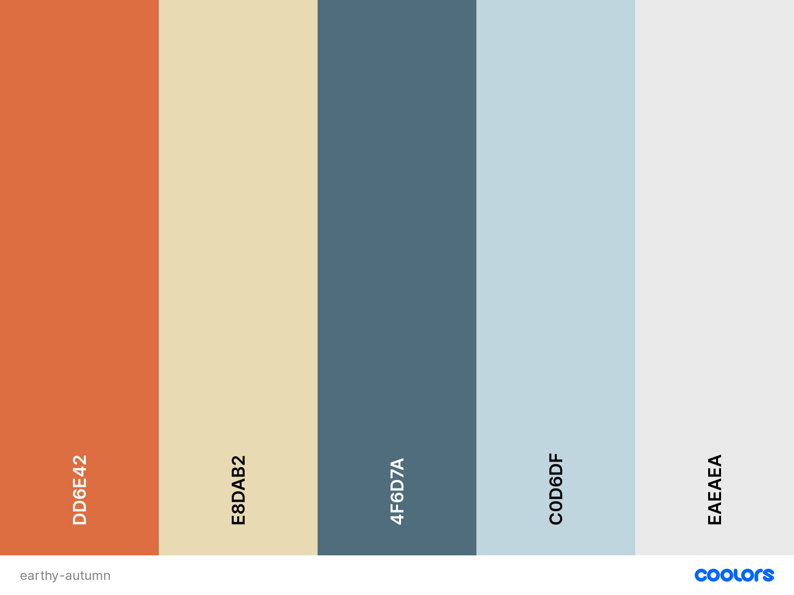

# Our Dacha

(insert picture here)

## Contents:

* UX 
    * Project Goals
    * Target Audience Goals
    * Site Owner Goals
    * User Requirements and Expectations
    * Design Choices 
        * Fonts
        * Icons
        * Colours
        * Styling
        * Images
        * Backgrounds
* Wireframes 
* Features 
    * Features that have been developed
    *  Features that will be implemented in the future
* Technologies Used 
* Deployment 
* Credits 

## UX (User Experience) ##
---
### Project Goals ### 

The goal for this project is to highlight the importance of self-sustaining ways of living or ways of living which allow people to occasionally escape city lives and reconnect with the natural world.

### User Goals ###

* To find information about the origin of dachas and similar concepts taken from other cultures.
* To view an array of dacha images which would spark curiosity and allow to envision personal goals.
* To learn the value of being closer to nature by way of lifestyle.
* Join a community of like-minded people to share personal experiences and promote holistic values.

### User Stories ###

* As a **user**, I want a well illustrated and telling website so I will be informed as well as entertained.
* As a **user**, I want to find information which allows me to clearly understand the concept of a dacha.
* As a **user**, I want to be able to request additional information and share my ideas about the site content.

### Site Owner Goals ###

* As a **site owner**, I want to outline what a dacha is and it's purpose.
* As a **site owner**, I want to inspire users to consider a wholesome lifestyle for themselves and wider community.
* As a **site owner**, I want to be able to connect with users if they wish to share ideas for the website or give feedback about their experience as a visitor or community member.

### User Requirements and Expectations ###

**Requirements**

* Be able to navigate the website by using the navbar.
* To include coherent information about the purpose of the website.
* Content to be displayed in a visually appealing and not misleading manner.
* To have a functional contact form and radio button.

**Expectations**

* Navigation is simple to use and navigates easily around the website.
* Content is clearly laid out and is informative.
* Visually appealing data from external sources.
* Quick load time of the website.

### Design Choices ###
---

**Fonts**

**Fonts** that have been provided by [GoogleFonts](https://fonts.google.com/).

* **Text of the body font-family:** 'Montserrat', sans-serif; 
* **Text of headers and titles:** 'Roboto', sans-serif;

**Icons**

**Icons** have been provided by [Font Awesome](https://fontawesome.com/), used sporadically.

**Colours**

The **colours** that are used:

* For body text and some titles: Cadet #4F6D7A;
* For some headers and titles: Burnt Sienna #DD6E42;
* For body background: White #ffffff;
* For additional backgrounds: Dutch White #E8DAB2;

 

I used [Coolors]("https://coolors.co/") colour palette to create the colour scheme you see here.

## Wireframing ##
---
I used [Balsamiq](https://) to create wireframes. This produced simple wireframes which I used to get an idea of which layouts would work better on different size screens.

See below for wireframes specific to device:

*   [Mobile Wireframe]("/")
*   [Tablet Wireframe]("/")
*   [Desktop Wireframe]("/")

Soon after I created wireframes for this website on paper, I realised that my target audience would not favour having to navigate across multiple pages, therefore, I switched to a landingpage design instead and with sections rather than pages.

 Write here about the development of the page content. What fitten well and what had to be reconsidered.

## Features ##
---
**Features** that have been implemented:

* Easy on the eye design.
* Easy to use navigation across different screensizes.
* Contact form with radio button.
* Social media links.

**Features** to be added in the future:

* Case studies
* Video playback
* Blog / Forum

## Technologies ##
---
**Languages**

* [HTML](https://html.com/)
* [CSS](https://skillcrush.com/blog/css/)

**Tools & Libraries**

* [Git](https://git-scm.com/)
* [Bootstrap](https://getbootstrap.com/)
* [Font-Awesome](https://fontawesome.com/icons?d=gallery)
* [Google fonts](https://fonts.google.com/)

## Testing ##
---

* 
* 
* 
* 

## Bugs ##
---

**During development**

* 
* 
* 
* 

**During testing**

* 
* 
* 

**From peer code review**

* 
* 
* 

## Deployment ##
---
** / **

## Credits ##
---
** / **
* 
* 

**Images**

Images section:

General:

